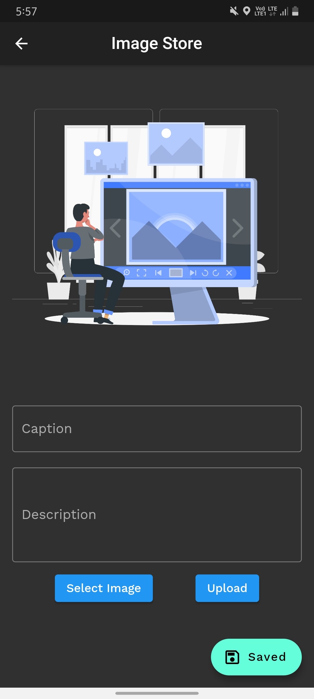
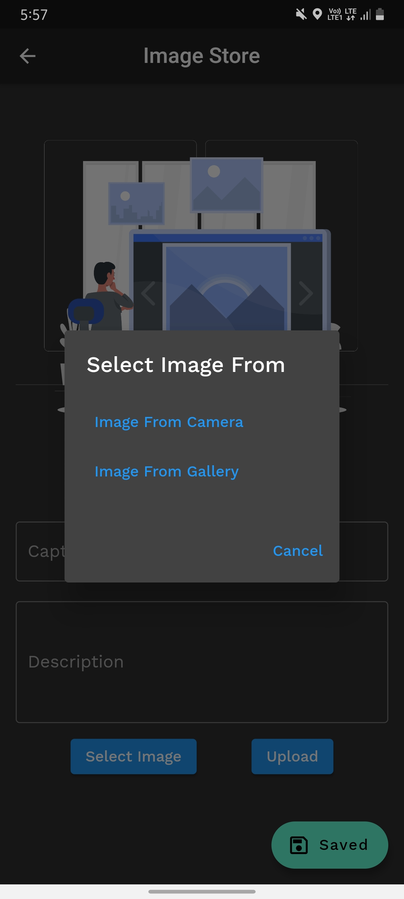
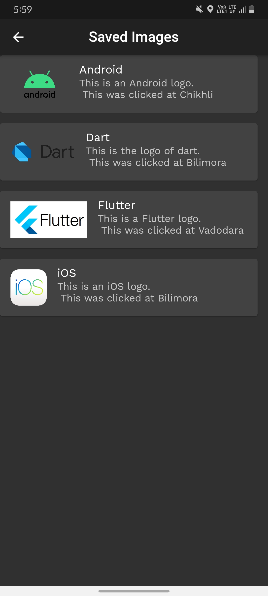
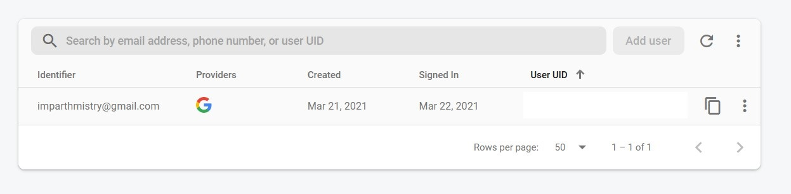
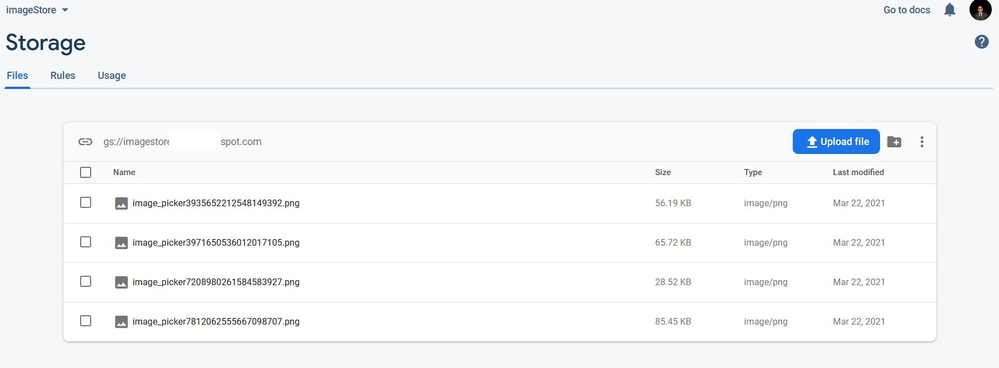
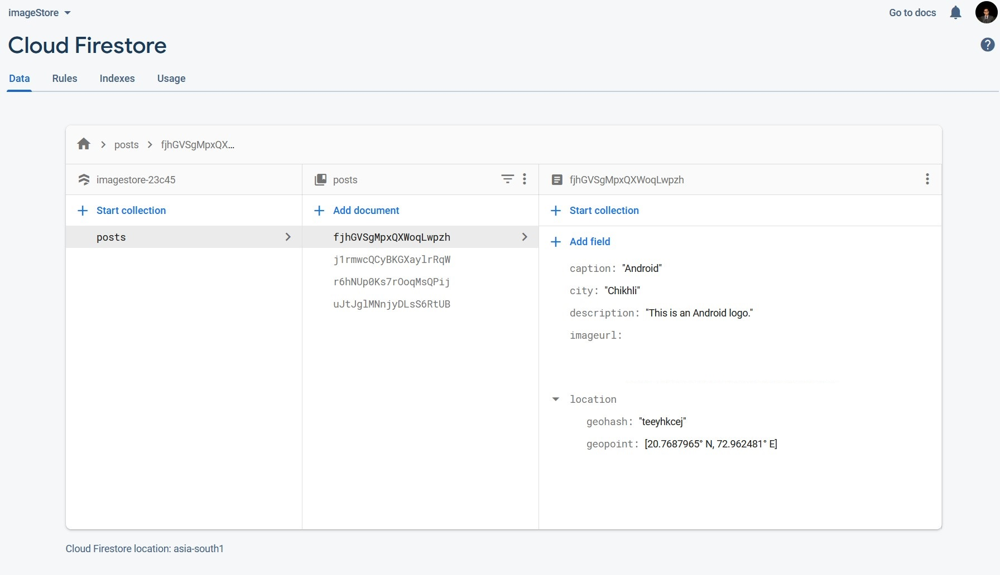

# Image Store
>by Parth Mistry

* It is an application which is built on Flutter to store Images in Cloud on Firebase FireStore.
* This application is built according the the interview assesment given to me by the Noob Community.
* There are sevral libraries which are used in this project which are listed below.
* The user need to login using the Google ID to do the following tasks.
---
## Specifications:
**Flutter Version:** 2.1.0-12.2.pre - beta  
**Dark SDK Version:** 2.13.0  
**Packages Used:**
- image_picker: Used to load images from camera or from gallery.
- firebase_core: Used to initialize the firebase app.
- firebase_storage: Used to store images in google cloud storage.
- cloud_firestore: Used for the database.
- firebase_auth: Used for signing in the user.
- google_sign_in: Also used for signing in the user.
- path: Used to manipulate the path of the loaded image.
- location: Used to get the coordinates of the user.
- geoflutterfire: Used to save the coordinates in the form of geopoints on FireStore
- geocoder: Used to get address from the latitudes and longitudes.

**Font Used:** Work Sans  
**Design:** Google Material Design

---
## Directory Structure:
```
lib
|- screens
|  |- home_screen.dart
|  |- login_screen.dart
|  |- saved_screen.dart
|
|- utilities
|  |- constants.dart
|
|- main.dart
```
---
## Flow Of The Application:
1. User will log in using Google credentials.
2. Home screen of the app will open after the logging in.
3. Here the user will write the caption of the image, description and select the image eiether from the camera or from the gallery.
4. The ```path``` package will tweak the path of that image as it will get easier to store on the cloud without creating any directories. And we will also receive a download URL of that same image.
5. As the image is getting loaded, ```location``` package will detect the latitude and longitude of the user. Then these coordinates will be provided to ```geocoder``` which will return the city name of that locality. And we will also preserve a copy of them in form of GeoPoints.
6. The image will be stored in google cloud storage using ```FirebaseStorage``` and the caption, description, geopoints and city will be uploaded to the ```Cloud Firestore```. After completion of the upload we will get a dialog box saying upload complete.
7. There is a floating action button saying saved images. It will return all the images along with their location and description and caption in a list.
---
## Screens:  
<table>
    <tr>
        <td> </td>
        <td> </td>
        <td> </td>
        <td> </td>
    </tr>
    <tr>
        <td colspan=4> </td>
    </tr>
    <tr><td colspan=4> </td></tr>
    <tr><td colspan=4> </td></tr>
</table>

---
## Try it out:
* You can try this app, the .apk file is in the release section of this repository.  

**Note:** You will not be able to run this code as google_services,json files is deleted from the directory due to security reasons.

